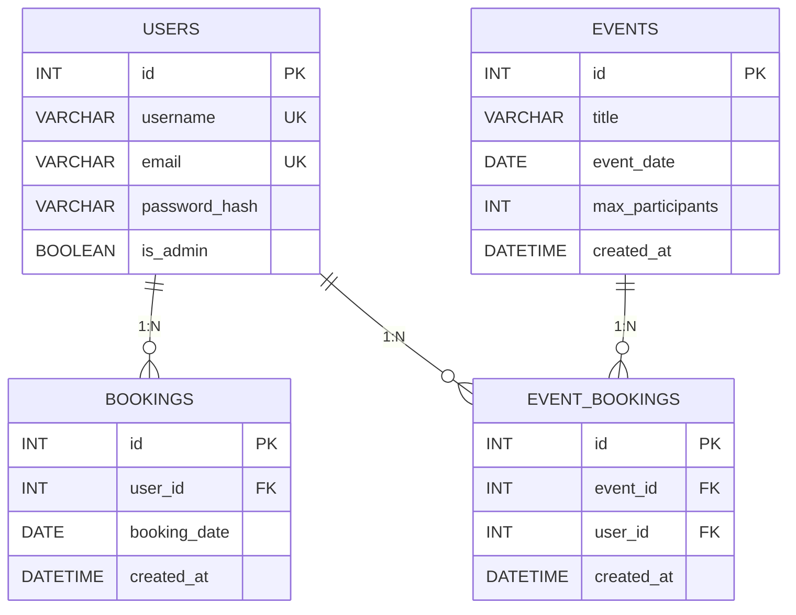
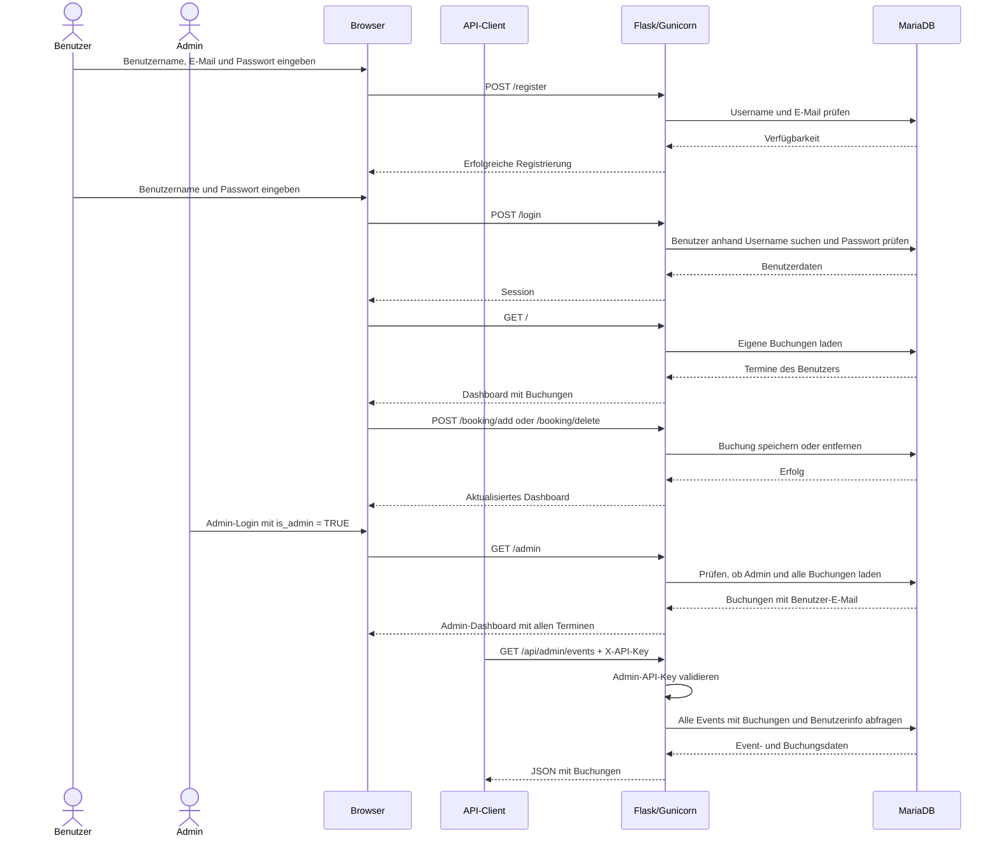
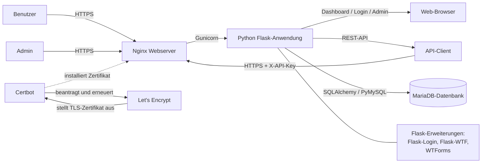

# GitFit

Flask-Webapp zur Registrierung, Anmeldung und Verwaltung von Trainingsbuchungen.

## Starten

```bash
pip install -r requirements.txt
python app.py
```

Benötigt eine MariaDB. Die Zugangsdaten und der API-Key werden über eine `.env`-Datei gesetzt (`DB_USER`, `DB_PASSWORD`, `DB_HOST`, `DB_NAME`, `SECRET_KEY`, `ADMIN_API_KEY`). Die Tabellen stehen in `schema.sql`.


### Admin-Zugriff

Administratoren können im Browser unter `/admin` Benutzer, Events und pendente Zahlungen verwalten. Für externe Clients stehen die geschützten Endpunkte `GET /api/admin/users/pending-payments` und `GET /api/admin/events` zur Verfügung.

Die Berechtigung wird ausschliesslich über das Feld `is_admin` in der Datenbank vergeben. Es gibt keine Weboberfläche zum Erstellen oder Ändern von Admin-Benutzern. Für neue Installationen kann ein Benutzer nach der Registrierung direkt in MariaDB zum Admin gemacht werden:

```sql
UPDATE users
SET is_admin = TRUE
WHERE email = 'admin@beispiel.ch';
```

Bei einer bestehenden Datenbank muss die neue Spalte einmalig ergänzt werden:

```sql
ALTER TABLE users
ADD COLUMN is_admin BOOLEAN NOT NULL DEFAULT FALSE;
```

Für `/admin` ist eine normale Browser-Anmeldung erforderlich. Für die API-Endpunkte muss der statische API-Key als `X-API-Key`-Header übergeben werden.

## API-Schnittstelle

Die API stellt zwei geschützte Admin-Abfragen bereit. Der statische API-Key wird nur auf dem Server in der `.env`-Datei gespeichert und muss im Header übergeben werden:

### `GET https://lab11.ifalabs.org/api/admin/users/pending-payments`

```bash
curl https://lab11.ifalabs.org/api/admin/users/pending-payments -H "X-API-Key: <ADMIN_API_KEY>"
```

### `GET https://lab11.ifalabs.org/api/admin/events`

```bash
curl https://lab11.ifalabs.org/api/admin/events -H "X-API-Key: <ADMIN_API_KEY>"
```

Nur Anfragen mit dem korrekten API-Key können diese Endpunkte verwenden. Der Key läuft nicht automatisch ab und kann durch Änderung der `.env`-Variable ersetzt werden. 


## Systemdokumentation

### Datenmodell als ERD



Die Tabelle `users` speichert Benutzerkonten inklusive Admin-Flag `is_admin`. Ein Benutzer kann mehrere Trainingsbuchungen besitzen. Jede Buchung verweist über `user_id` auf genau einen Benutzer. Die Kombination aus Benutzer und Datum ist eindeutig, damit derselbe Termin nicht doppelt gebucht werden kann. Im Dashboard werden nur die eigenen Buchungen angezeigt, im Admin-Dashboard alle Buchungen mit Benutzer-E-Mail.

Die Tabelle `users` speichert die Benutzerkonten. Ein Benutzer kann mehrere Trainingsbuchungen besitzen. Jede Buchung verweist über `user_id` auf genau einen Benutzer. Die Kombination aus Benutzer und Datum ist eindeutig, damit derselbe Termin nicht doppelt gebucht werden kann. Beim Löschen eines Benutzers werden seine Buchungen ebenfalls gelöscht.

### Wichtigster Ablauf als Sequenzdiagramm



Über die Weboberfläche meldet sich der Benutzer an und gelangt zum Dashboard. Dort wird ein gültiges Datum ausgewählt und eine Buchung gespeichert. Die Anwendung akzeptiert nur Termine ab dem aktuellen Tag und maximal 120 Tage im Voraus. Bereits vorhandene Buchungen können im Dashboard gelöscht werden. Externe Clients authentisieren sich für die Admin-Abfragen mit dem statischen `X-API-Key`.

### Bereitstellung der Komponenten



Nginx nimmt die HTTPS-Anfragen entgegen und leitet sie an Gunicorn weiter. Browser und API-Clients nutzen dieselbe Flask-App, wobei der Browser das Dashboard und das Admin-Dashboard rendert und die API administrative Abfragen mit dem `X-API-Key` schützt. Certbot verwaltet die TLS-Zertifikate von Let's Encrypt. Gunicorn startet und verwaltet die Python-Flask-Anwendung. Flask verarbeitet Browserseiten und REST-API-Anfragen. Flask-SQLAlchemy und PyMySQL verbinden die Anwendung mit MariaDB. Flask-Login verwaltet Browser-Sitzungen; Flask-WTF und WTForms validieren die Webformulare, während `email-validator` E-Mail-Adressen prüft. `cryptography` unterstützt die HTTPS-Umgebung.


